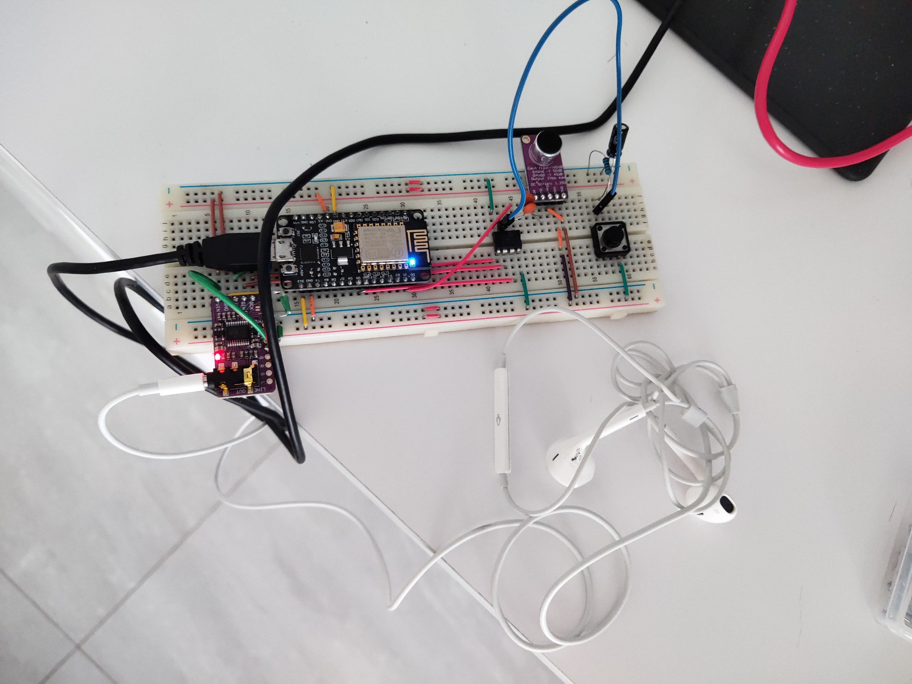

BellioT - IoT Bell
==================

Contents
--------

- [Intro](#intro)
    - [What is it?](#what-is-it)
    - [Why do I need it?](#why-do-i-need-it)
    - [What are the features?](#what-are-the-features)
- [Details](#details)
    - [Components](#components)
    - [Wiring](#wiring)
    - [Description](#description)
    - [Demo Images](#demo-images)
    - [Problems and Limitations](#problems-and-limitations)
- [Progress](#progress)
- [Credits and References - TBA](#credits-and-references)
    - [MCP3202 Usage](#mcp3202-usage)
    - [ESP8266 I2S Usage](#esp8266-i2s-usage)
    - [ESP32 Timer Interrupt Usage](#esp32-timer-interrupt-usage)
    - [PCM5102 Module Wiring](#pcm5102-module-wiring)
    - [Libraries](#libraries)

Intro
-----  

### What is it?
An IoT Door Bell that enables indoor people to see and talk easily with outdoor guests.

### Why do I need it?
In my house, my room is quite high from the ground. So whenever a guest presses my house's bell, I have to go to the first floor to ask who that is. That's very inconvenient. Of course I can just shout out from upstairs, but that is not very nice. So this device may make my life easier.

### What are the features?
The bell is connected to a master device via Wifi and MQTT, and the two devices behave like two telephones. I can talk easily to the guest (and may even see his/her face with a camera --- hopefully, not done yet). I am also thinking about extending it so that I can use a mobile app to communicate with my guest when I'm not at home.

Details
-------

### Components

- ESP32/ESP8266 x2
- PCM5102 Module x2 (the purple one)
- MCP3202 12-bit ADC x2 (BI/P is the one comaptible with breadboard)
- MAX9814 module with AGC x2
- A Raspberry Pi to run Mosquitto MQTT Broker

### Wiring

For Master device (ESP8266 NodeMCU):  

For Bell device (ESP32-CAM):  

### Description

#### The general idea:  
MAX9814 is the sensor to record audio from the environment. The external ADC MCP3202 with read the values (frequency = 8kHz) and send to the ESP via SPI. The ESP buffers 80 16-bit samples of data, then it sends the audio data (8-bit, so the payload has 160 values) to its designated MQTT topic. The other ESP reads from that topic and uses I2S to play the audio via the external DAC PCM5102.  

Note that each device acts as both the transmitter and receiver, just like telephones.

#### Connection protocol between Master and Bell:  

Each device has 3 states:  
- SLEEP: the device does not transmit/play audio
- CALL: the device transmits and play received audio data
- TERM: the intermediate state when transition from CALL to SLEEP. This is to make sure the other device has also slept.  

This is a typical scenario: a guest presses the bell -> bell device is now CALL and transmit data -> the host press button on master device to accept call -> two devices enter bi-directional call -> the host press button again to cancel call.

Call can also be activated from the master device: host activate call -> bell device automatically enter call.

Note that the master device decides whether to accept a call or not. Calls have limitation of 10 minutes (so if the host forgets to terminate call, the call will be automatically terminated to prevent outsiders from keeping listening to indoor voices).

#### If you want to try my code, do the following steps:  

- Remember to change Wifi credentials and server IP in the code to your own
- First run a MQTT broker on Raspberry Pi:  `mosquitto -p 2883`  
- Then power on two devices. They will publish data in topics "audioMaster" and "audioBell".

### Demo Images

Master device:

Bell device:

### Problems and Limitations

Here are some problems that I couldn't fix yet:
- Noise: not much, but notable
- ~~Can't implement full protocol on ESP32: I'm getting watchdog timeout error anytime I use millis(). From my tests, I believe it is not hardware error but software. I may have missed something about millis() on ESP32 (on ESP8266 it worked perfectly).~~
- Sound is not good in the ESP8266 device after fixing watchdog timeout on ESP32

Progress
--------

For now the basic functions are almost completed. Audio transmission is clear but with notable noise. A full connection protocol is also developed.

These are the things I want to add in the future:  

- Camera stream to a NodeJS server using WebSocket
- Integrate LCD to see the camera directly from the Master device
- Provide an UI to set up SSID and Password easily
- Integrate EEPROM to store credentials (..is this secure?)
- Reduce noise, maybe by implementing some kind of codec
- Integrate with a smart home network
- Finally, design a case so that it becomes a complete product

Progress:
- 25/06/2021: completed audio transmission between bell device and master device
- 27/06/2021: 
    - added basic feature of a bell: a button to press, with hardware debounce  
    - completed the connection protocol between master device and bell device
    - almost completed implementation on real hardware ("almost" because there's some problem on ESP32 I can't fix yet)
- 28/06/2021:
    - fixed watchdog timeout error on ESP32. Now both devices are working correctly according to the protocol!

Credits and References
----------------------

- MCP3202 Usage: https://github.com/souviksaha97/MCP3202
- ESP8266 I2S Usage: TBA
- ESP32 Timer Interrupt Usage: https://diyprojects.io/esp32-timers-alarms-interrupts-arduino-code/
- PCM5102 Module Wiring: https://github.com/earlephilhower/ESP8266Audio
- Libraries:
    - PubSubClient: https://github.com/knolleary/pubsubclient
    - ESP8266TimerInterrupt: https://github.com/khoih-prog/ESP8266TimerInterrupt